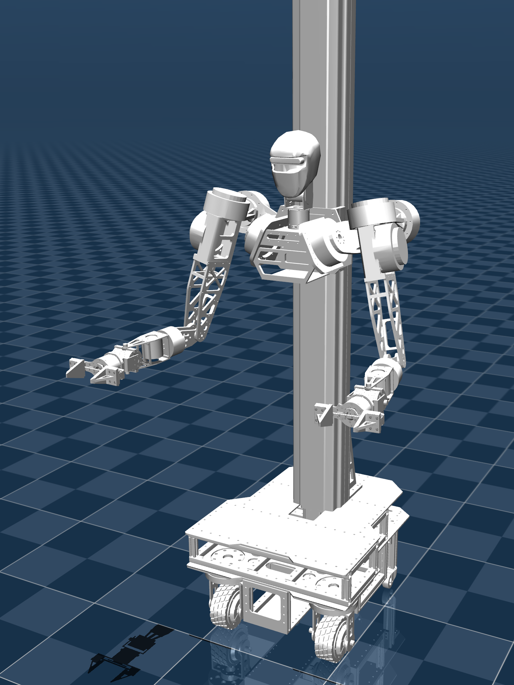
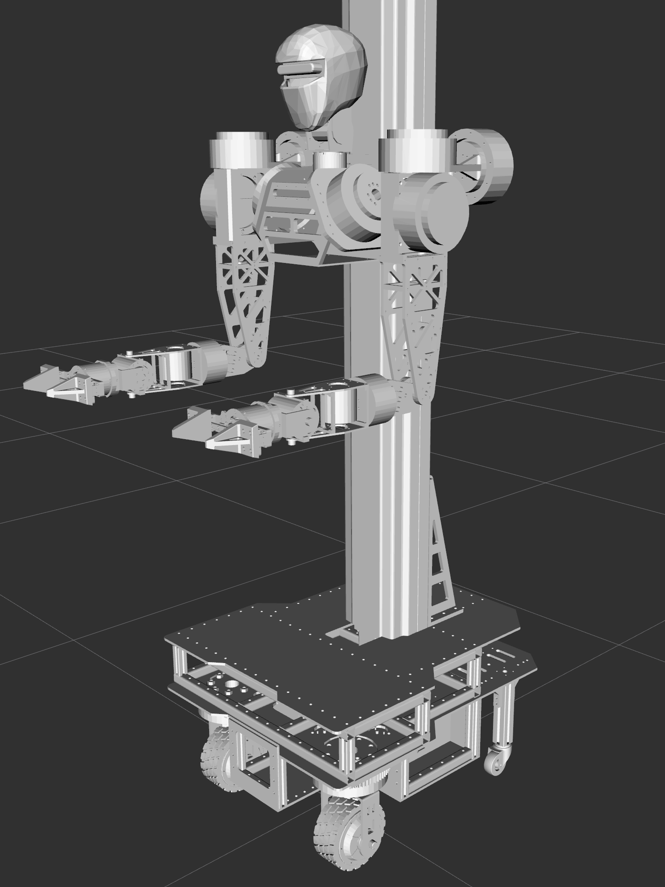

# Mantis1.0 URDF 模型

<div align="center">


[🌟 English](README_EN.md) | [🌏 中文](README.md)

</div>

本仓库提供蓝虫具身 Mantis1.0 机器人的统一机器人描述格式（URDF）文件。

📚 [模型文件说明](docs/README.md)

文档负责人：[@ACESUSUSU](https://github.com/ACESUSUSU)

|  |  |  |
|:--:|:--:|:--:|
| **mujoco 预览** | **真机预览** | **rviz 预览** |

## 核心特性

Mantis 1.0 URDF 模型包含：
- 舵轮底盘+升降滑台式躯干：实现三维工作空间覆盖
- 七自由度双臂：模拟人体工作空间
- 齿轮齿条双指夹爪：自适应力反馈夹持

## 适用环境

当前仓库尚未在README中固定Ubuntu和ROS 2版本。正式发布安装教程前，应由负责人补充已经测试的版本，不应写成适用于所有Mantis型号。

## 主要目录

- `urdf/`：机器人URDF文件；
- `urdf_full/`：完整模型文件，具体区别待负责人补充；
- `meshes/`：普通网格文件；
- `meshes_full/`：完整网格文件，具体区别待负责人补充；
- `config/`：模型相关配置；
- `launch/`：启动文件；
- `rviz/`：RViz配置。

## 快速开始

启动可视化 launch 文件：
```shell
ros2 launch lanchong_description display.launch
```

启动后应在RViz中检查机器人模型、关节、TF和网格是否完整。将模型用于真机控制前，必须确认模型版本与机器人硬件版本一致。
