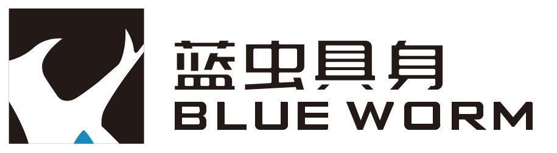
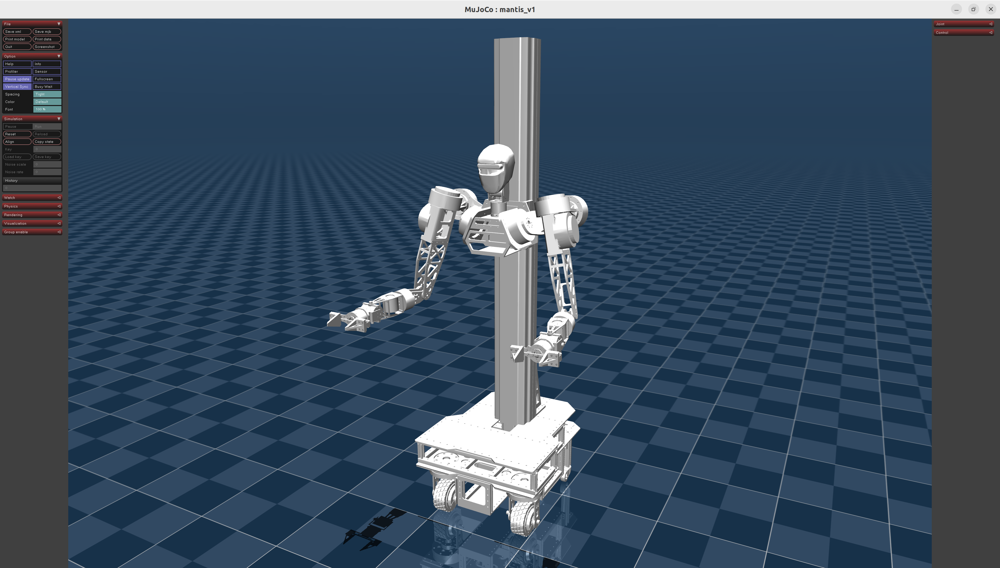

# Mantis1.0 URDF Model

<div align="center">



[🌟 English](README_EN.md) | [🌏 中文](README.md)

</div>

This repository provides the urdf file of Mantis1.0, designed by BlueWorm EAI Tech.

 <!-- 请替换实际图片路径 -->

## Core Features

Mantis 1.0 URDF includes：
- Omnidirectional Chassis + Lifting Torso: 3D workspace coverage
- 7DOF Dual-Arm: human-like workspace
- Parallel-Jaw Gripper：adaptive + force feedback

## Quick Start

Launch the following command to visualize the robot and move the joints:
```shell
ros2 launch lanchong_description display.launch
```
